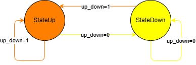
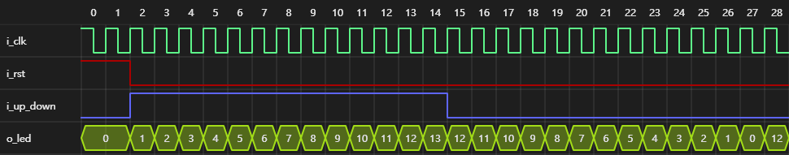
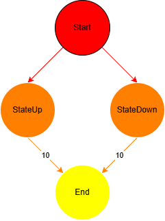
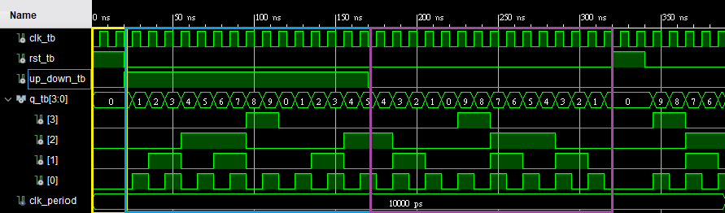

# VHDL Up/Down Decade Counter (0-9)

這是一個使用 VHDL 實現的 0-9 十進位計數器專案，具備上數 (Count Up) 與下數 (Count Down) 功能，並包含完整的模擬測試平台 (Testbench) 與系統架構圖表。

## 📝 專案介紹

本專案實作了一個同步計數器，能夠透過 `up_down` 控制信號決定數數方向：
- **上數模式 (Up)**: 0 → 1 → ... → 9 → 0 (循環)
- **下數模式 (Down)**: 0 → 9 → 8 → ... → 0 (循環)
- **重置 (Reset)**: 支援重置功能，將計數歸零。

## 📂 檔案結構

| 檔案名稱         | 說明                                     |
| ---------------- | ---------------------------------------- |
| `counter.vhd`    | 計數器主程式 (VHDL Source Code)          |
| `tb_counter.vhd` | 測試平台 (Testbench)，用於驗證邏輯正確性 |
| `*.drawio`       | 使用 Draw.io 繪製的原始圖表檔            |
| `img/`           | 存放架構圖與測試結果圖片                 |

---

## 📊 系統架構與圖表 (Diagrams)

以下是本專案的系統設計圖表，從功能分解到詳細的狀態機設計。

### 1. 功能分解圖 (Break Down Structure)
展示了計數器的輸入、輸出以及內部邏輯模組的階層結構。

### 2. 有限狀態機 (FSM - Finite State Machine)
描述了計數器在 0 到 9 之間的狀態轉換邏輯。綠色箭頭代表上數，紅色虛線代表下數。

### 3. 訊息序列圖 (MSC - Message Sequence Chart)
顯示了 Testbench 與 Counter (DUT) 之間的信號交互時序。包含 Reset、計數開始與方向切換的過程。

### 4. 演算法流程圖 (AOV - Activity On Vertex)
詳細描述了每一個時脈週期 (Clock Cycle) 內的邏輯判斷流程，包含上數/下數檢查與溢位處理 (Wrap-around)。

---

## 🚀 成果展示

下圖為模擬波形結果或系統實作的視覺化展示，驗證了計數器在不同模式下的正確性。

### 模擬結果
.png)

> * **圖片說明** : 黃色方框為Reset階段 rst_tb = '1'，藍色方框為up_down_tb = '1'時的計數結果，紅色方框為up_down_tb = '0'時的計數結果。

