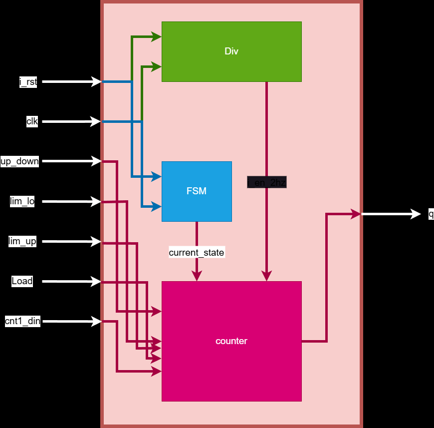
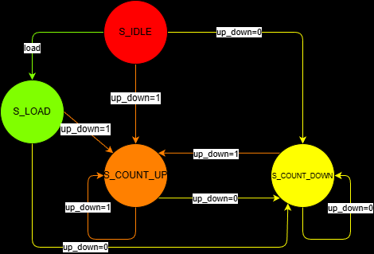
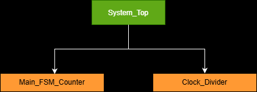
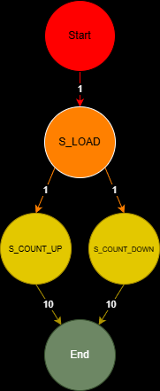
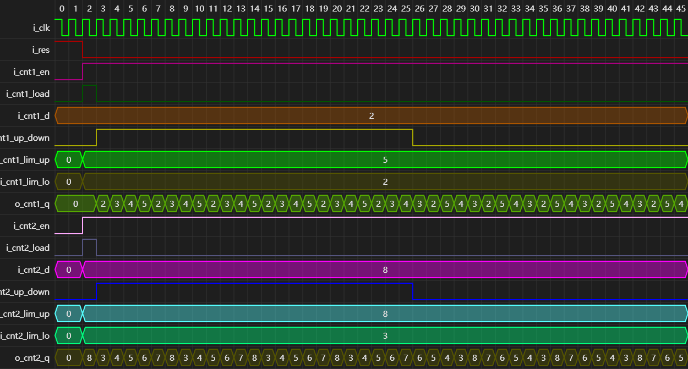
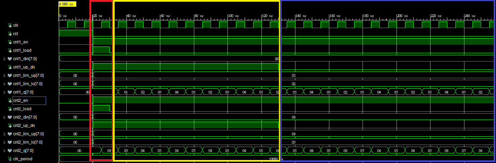

# 雙可配置計數器專案 (Dual Configurable Counters Project)

## 專案介紹 (Project Introduction)
這是一個基於 VHDL 的雙計數器系統設計。該專案包含一個頂層模組 `DualCounters_Top`，在其中實例化了兩個 `ConfigurableCounter`。每個計數器都具備高度的可配置性，支援上下數、自定義上下限、數值載入等功能。

## 功能特點 (Features)
- **雙計數器架構**：系統內建兩個獨立運作的計數器。
- **可配置位寬**：透過 Generic 參數 `WIDTH` 設定計數器的位元寬度（預設 8 bits）。
- **靈活控制**：
    - 支援同步計數使能 (`i_en`)。
    - 支援數值載入 (`i_load`, `i_d`)。
    - 支援上下數模式切換 (`i_up_down`)：`1` 為上數，`0` 為下數。
    - 支援動態設定計數上下限 (`i_limit_upper`, `i_limit_lower`)。

## 系統架構 (System Architecture)

本專案採用結構化設計，`DualCounters_Top` 作為頂層模組，負責連接與控制內部的兩個計數器實例。

## 模組說明 (Module Description)

### ConfigurableCounter
核心計數器模組，負責實際的計數邏輯。
- **輸入 (Inputs)**: `i_clk`, `i_res`, `i_en`, `i_load`, `i_up_down`, `i_d`, `i_limit_upper`, `i_limit_lower`
- **輸出 (Outputs)**: `o_q`

### DualCounters_Top
頂層模組，將兩個 `ConfigurableCounter` 封裝，並提供獨立的控制介面。

## 邏輯設計與流程 (Logic Design & Flow)

### 有限狀態機 (FSM)

### 訊號流程 (Flow Breakdown)

### 活動圖 (Activity on Vertex - AOV)

### 訊息序列圖 (Message Sequence Chart - MSC)

## 模擬結果 (Simulation Results)
.png)
模擬展示了計數器在不同模式下的運作情形，包括重置、載入數值、上下數切換以及達到邊界時的行為。

* **圖片說明** 
* 紅色方框 :Load,用於初始化時所載入之數值。
* 黃色方框 :黃色方框為上數模式,cnt1_q與cnt_2q會上數至上限值(cnt1_lim_up/cnt2_lim_up)再重新設定為下限值(cnt1_lim_down/cnt2_lim_down)。
* 藍色方框 :藍色方框為下數模式,cnt1_q與cnt_2q會下數至下限值(cnt1_lim_down/cnt2_lim_down)再重新設定為上限值(cnt1_lim_up/cnt2_lim_up)
---
**Note**: Source defined in `DualCounters_Top.vhd` and `ConfigurableCounter.vhd`. Testbench is provided in `Testbench.vhd`.
