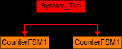
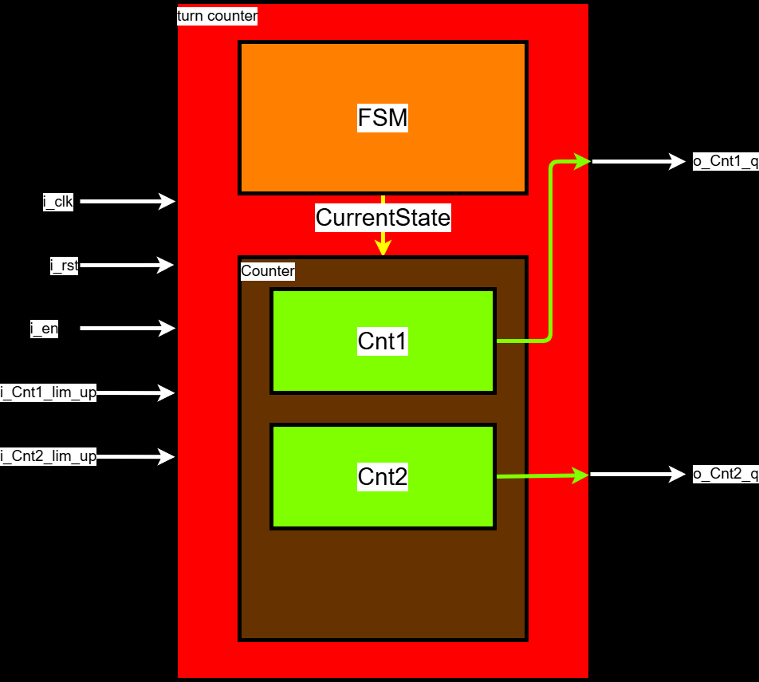
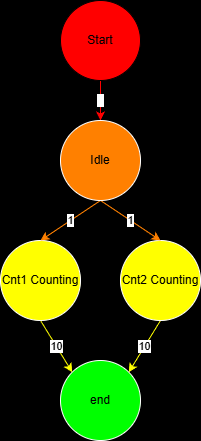
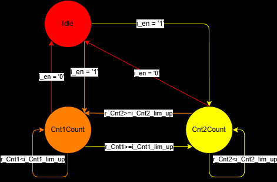
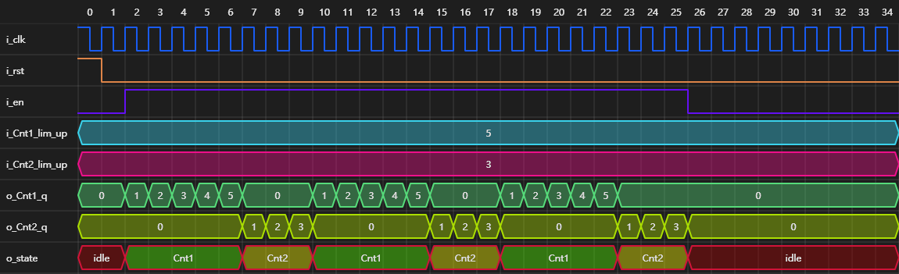
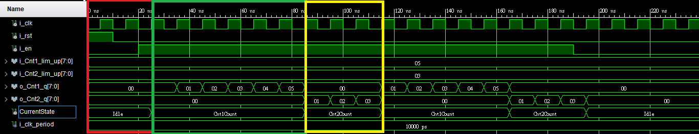

# 雙計數器狀態機 (Dual Counter FSM)

本專案實作了一個基於 VHDL 的雙計數器狀態機系統。該系統能夠在兩個計數器之間自動切換，並根據預設的上限值進行循環計數。

## 系統架構

系統由兩個獨立的計數模組與一個中央控制狀態機組成，透過 `i_en` 信號啟動，並具備動態配置上限的能力。

### 1. 模組分解 (Break Down)

### 2. 系統架構圖

### 3. 操作關係 (AOV)

---

## 狀態機設計 (FSM)

系統核心採用有限狀態機 (Finite State Machine) 控制，包含以下三種主要狀態：
- **Idle**: 系統閒置或重設狀態。當 `i_en = '0'` 時強制返回此狀態。
- **Cnt1Count**: 計數器 1 (Counter 1) 進行計數，直到達到 `i_Cnt1_lim_up`。
- **Cnt2Count**: 計數器 2 (Counter 2) 進行計數，直到達到 `i_Cnt2_lim_up`。

### 狀態轉移圖

### 訊息序列圖 (MSC)

---

## 模擬結果與驗證

透過 VHDL Testbench 進行驗證，確保計數器在切換點時能夠無縫銜接，並且在達到上限後正確重置並觸發下一個狀態。

### 模擬波形圖
.png)

> [!NOTE]
> 紅色方框為idle狀態，綠色方框為cnt1count狀態，黃色方框為cnt2count狀態。

---

## 腳位定義 (Pin Assignment)

| 腳位名稱        | 屬性 | 類型                  | 描述                                     |
| :-------------- | :--- | :-------------------- | :--------------------------------------- |
| `i_clk`         | 輸入 | STD_LOGIC             | 系統時鐘                                 |
| `i_rst`         | 輸入 | STD_LOGIC             | 非同步重設 (高電位觸發)                  |
| `i_en`          | 輸入 | STD_LOGIC             | 系統啟用 (High: 運作, Low: 返回 Idle)    |
| `i_Cnt1_lim_up` | 輸入 | STD_LOGIC_VECTOR(7:0) | 計數器 1 計數上限                        |
| `i_Cnt2_lim_up` | 輸入 | STD_LOGIC_VECTOR(7:0) | 計數器 2 計數上限                        |
| `o_Cnt1_q`      | 輸出 | STD_LOGIC_VECTOR(7:0) | 計數器 1 目標輸出                        |
| `o_Cnt2_q`      | 輸出 | STD_LOGIC_VECTOR(7:0) | 計數器 2 目標輸出                        |
| `o_state`       | 輸出 | STD_LOGIC_VECTOR(1:0) | 當前狀態編碼 (00:Idle, 01:Cnt1, 10:Cnt2) |

