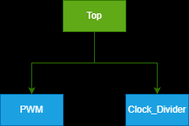
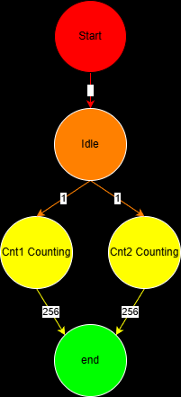
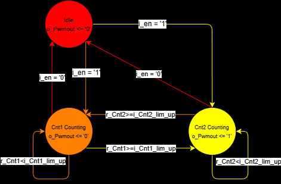

# PWM 呼吸燈設計專案

本專案實作了一個基於 VHDL 的 PWM 控制器，設計用於實現呼吸燈效果。系統主要由兩個計數器交替運作，透過狀態機控制 PWM 的「低電位」與「高電位」時長。

## 系統架構

系統採用元件化設計，整體架構圖如下：

### 核心設計規範
- **語言**：VHDL
- **控制方式**：有限狀態機 (FSM)
- **腳位定義**：
    - `i_clk` / `i_rst`: 時脈與重置
    - `i_en`: 啟動致能
    - `i_Cnt1_lim_up` / `i_Cnt2_lim_up`: 計數上限設定
    - `o_Pwmout`: PWM 訊號輸出

## 邏輯拆解與分析

為了確保設計的嚴謹性，我們先進行了功能拆解與動作流程規劃：

### 功能分析 (BreakDown)

### 動作順序規劃 (AOV)

## 狀態機設計 (FSM)

系統的核心邏輯由三個主要狀態組成：`Idle`、`Cnt1Count`、`Cnt2Count`。

- **Idle**：待機或重置狀態，所有計數器歸零。
- **Cnt1Count**：計數器 1 (Cnt1) 運行，此時 `o_Pwmout` 輸出為 `0`。
- **Cnt2Count**：計數器 2 (Cnt2) 運行，此時 `o_Pwmout` 輸出為 `1`。

## 模擬驗證

### 動態占空比模擬
在測試平台 (`PWM_tb.vhd`) 中，我們實作了動態占空比模擬變數 `r_DutyCycle`。如下圖所示，PWM 的高電位寬度會隨著計數周期逐漸增加：

### 計數器切換細節
下圖展示了 Cnt1 與 Cnt2 之間的精準切換邏輯：
.png)

## 檔案清單
- `PWM.vhd`: PWM 主核心程式。
- `PWM_tb.vhd`: 具備動態占空比測試邏輯的 Testbench。
- `img/`: 包含所有設計圖檔與模擬截圖。

---
*本專案由專業程式工程師開發，遵循 VHDL 標準規範與雙駝峰命名法。*
