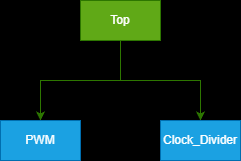
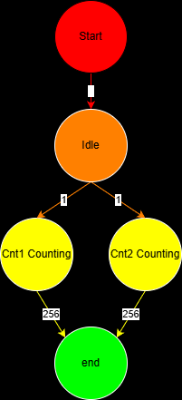
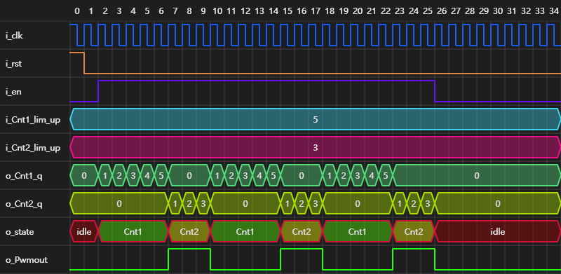
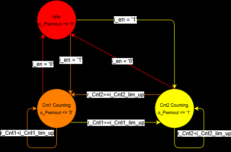
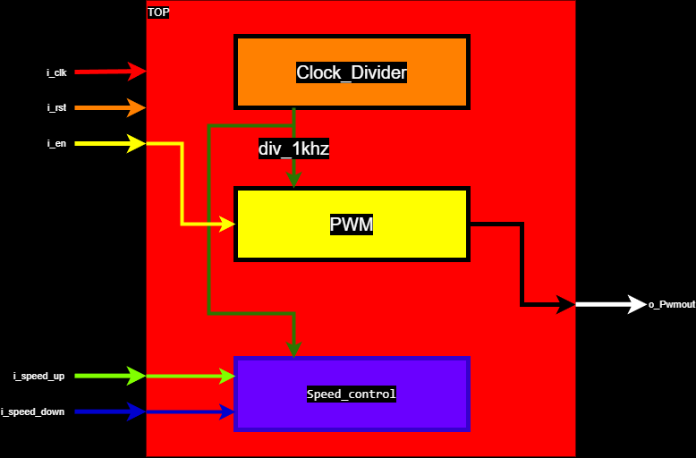
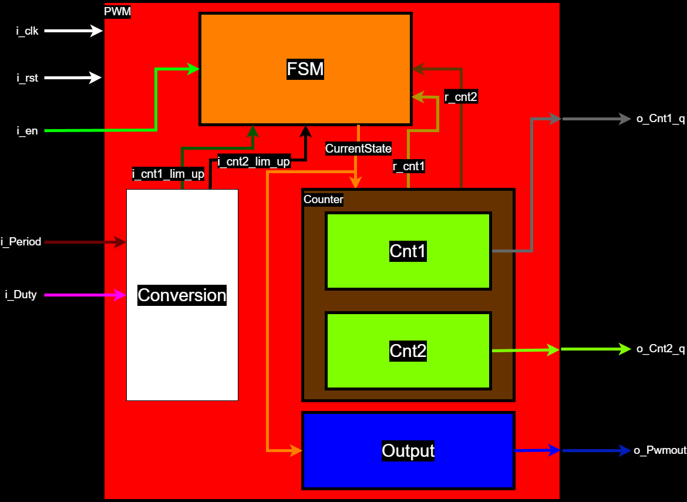
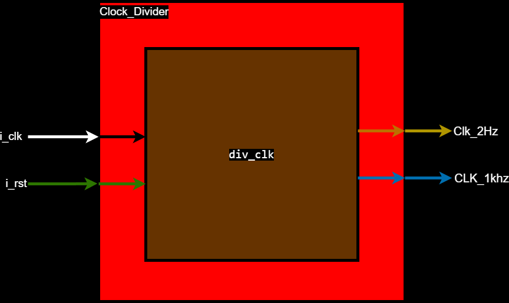

# PWM 呼吸燈設計專案

本專案實作了一個基於 VHDL 的 PWM 控制器，設計用於實現呼吸燈效果。系統主要由兩個計數器交替運作，透過狀態機控制 PWM 的「低電位」與「高電位」時長。

### 核心設計規範
- **語言**：VHDL
- **控制方式**：有限狀態機 (FSM)
- **腳位定義**：
    - `i_clk` / `i_rst`: 時脈與重置
    - `i_en`: 啟動致能
    - `i_Period` / `i_Duty`: PWM 週期與佔空比設定 (核心模組)
    - `i_speed_up` / `i_speed_down`: 呼吸燈速度控制 (實體按鈕)
    - `o_Pwmout`: PWM 訊號輸出

## 邏輯拆解與分析

為了確保設計的嚴謹性，我們先進行了功能拆解與動作流程規劃：

### 功能分析 (BreakDown)

### 動作順序規劃 (AOV)

### 訊息序列圖 (MSC)

## 狀態機設計 (FSM)

系統的核心邏輯由三個主要狀態組成：`Idle`、`Cnt1Count`、`Cnt2Count`。

- **Idle**：待機或重置狀態，所有計數器歸零。
- **Cnt1Count**：計數器 1 (Cnt1) 運行，此時 `o_Pwmout` 輸出為 `0`。
- **Cnt2Count**：計數器 2 (Cnt2) 運行，此時 `o_Pwmout` 輸出為 `1`。

## 系統架構

系統採用元件化設計，各模組的架構與其內部 Process 用途如下：

### Top 模組架構說明

> [!NOTE] 
> 
> 1. **Speed_control**：負責偵測實體按鈕輸入 (`i_speed_up`, `i_speed_down`)，並動態調整控制呼吸節奏的 `FlashSpeed` 常數。
> 2. **元件連接 (Port Map)**：整合並連接底層的 `Clock_Divider` 與 `PWM` 模組。

### PWM 核心模組架構說明

> [!NOTE]
> 
> 1. **Conversion**：根據外部輸入的 `i_Period` 和計算得到的動態 `i_Duty`，換算出計數器所需的正確計數上限。
> 2. **FSM**：管理有限狀態機 (FSM) 的狀態切換 (`Idle`, `Cnt1Count`, `Cnt2Count`)。
> 3. **Counter**：負責底層實體時鐘計數器 (`r_Cnt1`, `r_Cnt2`) 的累加邏輯。
> 4. **Output**：依照當下狀態輸出真正的 `o_Pwmout` 亮暗硬體訊號。

### Clock_Divider 除頻器架構說明

> [!NOTE]
> 
> 1. **div_clk**：負責將系統高頻時脈 (100MHz) 計數與降頻，輸出供底層 PWM 運行的基準時脈 (1kHz)。

## 模擬驗證

### 動態占空比模擬
在測試平台 (`PWM_tb.vhd`) 中，我們實作了動態占空比模擬變數 `r_DutyCycle`。如下圖所示，PWM 的高電位寬度會隨著計數周期逐漸增加：
.png)

> [!NOTE]
> 上圖可以發現o_Pwmout的工作週期慢慢上升。

### 計數器切換細節
下圖展示了 Cnt1 與 Cnt2 之間的精準切換邏輯：
.png)

>[!NOTE]
>上圖可以發現o_Cnt2_q2的數字正在增加，表示Cnt2正在計數，且o_Pwmout輸出為高電位(1)。

### PWM 模擬影片
以下是 PWM 控制器運作時的模擬影片展示：

> [!NOTE]
> 上圖可以發現o_Pwmout的工作週期慢慢上升又慢慢下降。

## 硬體實作設計 (On Board Program)

為將 PWM 模組應用於實際硬體呼吸燈，我們在 `on_board_program` 目錄下設計了 `Top.vhd` 頂層模組，並整合除頻器與呼吸燈變速控制。

### 實際腳位綁定 (XDC 設定)
- **輸入訊號**:
    - `i_clk`: 系統時脈 (Y9)
    - `i_rst`: 系統重置按鈕 (P16)
    - `i_en`: 啟動開關 (F22)
    - `i_speed_up`: 加快呼吸燈循環速度按鈕 (T18)
    - `i_speed_down`: 減慢呼吸燈循環速度按鈕 (R16)
- **輸出訊號**:
    - `o_Pwmout`: 呼吸燈 PWM 輸出至 LED (T22)

### 頂層邏輯實作
- **時脈除頻 (Clock Driver)**：將原 100MHz 系統時脈降頻為 1kHz，送入 PWM 控制模組。
- **動態工作週期 (Dynamic Duty Cycle)**：利用 `LoopCnt` 於 0 到 254 之間來回循環遞增與遞減，動態輸入給 `i_Duty`，實現漸亮與漸暗的呼吸燈效果。
- **變速機制 (Speed Control)**：透過外部實體按鈕 (`i_speed_up` 與 `i_speed_down`) 動態微調狀態計數器延遲閥值 (`FlashSpeed`)，藉此改變呼吸的快慢節奏。

## 成果展示

完整的實際運作成果影片，請觀看以下 YouTube 連結：

