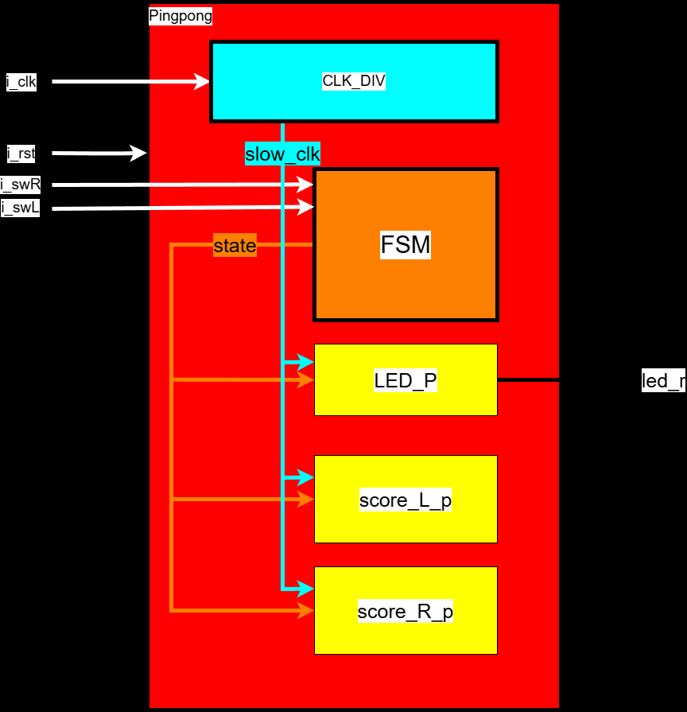
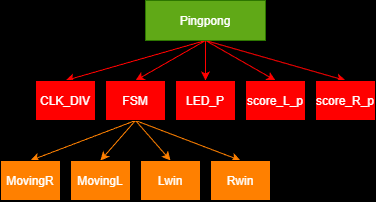
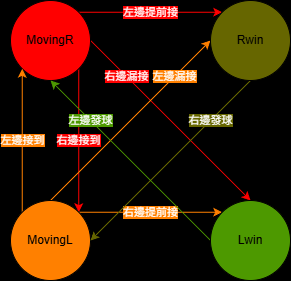
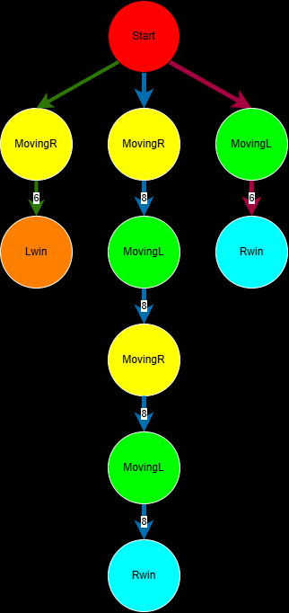

# PingPong 乒乓遊戲專案

## 專案簡介
本專案使用 VHDL 實作一個簡單的乒乓球遊戲。遊戲透過 LED 的移動來模擬球的運動，並使用開關（Switch）作為擊球控制器。

---

## 設計文件與圖示

### 系統架構圖
描述專案的整體模組設計與訊號連接。

> **CLK_DIV**: 除頻器，將系統時鐘降頻以適合人類肉眼觀察 LED 移動。
> **FSM**: 處理遊戲規則，判斷擊球時機、得分以及狀態切換。
> **LED_P**: 根據FSM輸出的狀態控制 LED 的移動。
> **Score_L_p**: 紀錄左球員分數。
> **Score_R_p**: 紀錄右球員分數。
---

### Break Down
將專案功能拆解為各個子模組或處理程序。

> ** MoveingR**:球往右移動
> ** MoveingL**:球往左移動
> **Rwin**:右球員得分
> **Lwin**:左球員得分
---

### 有限狀態機 (FSM)
描述遊戲邏輯的狀態轉換，包含移動、得分與發球狀態。

---

### 非週期操作 (AOV)
描述異步操作或特定事件的觸發邏輯。

---

### 訊息序列圖 (MSC)
描述各組件間的溝通與時序關係。

---

## 模擬成果

### 模擬結果 (原圖)
ModelSim 或 Vivado 模擬產生的波形圖。
.png)

---

### 模擬結果 (標示版)
標註了狀態切換與關鍵訊號變化的波形圖。
.png)

> **紅色方框** : 預設向右發球
> **紫色方框** : 右球員發球
> **橙色方框** : 右球員提前擊球
> **藍色方框** : 左球員發球
> **灰色方框** : 右球員擊球
> **黃色方框** : 右球員漏接

