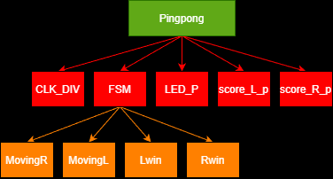
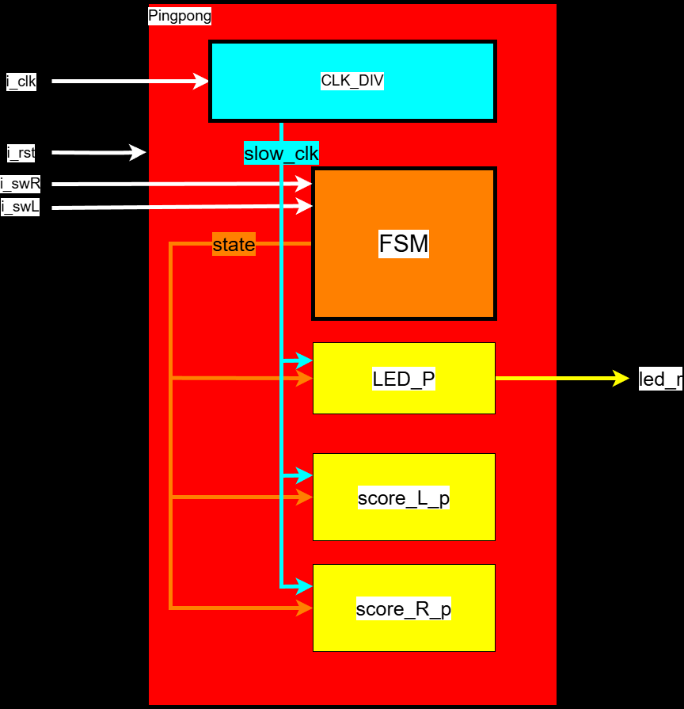
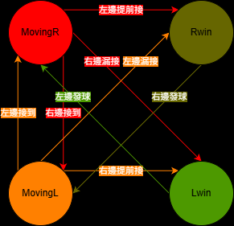
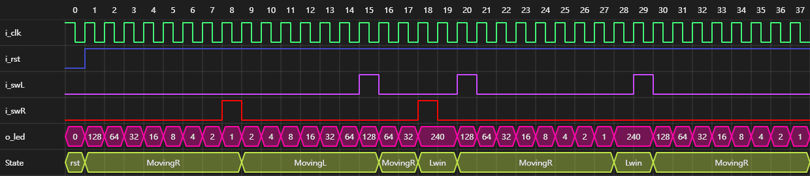
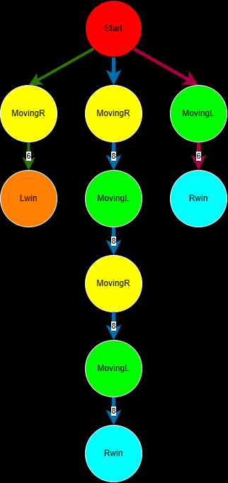

# PingPong 乒乓遊戲專案 (VHDL)

本專案使用 VHDL 在 FPGA 開發板（基於 Xilinx Artix-7/Basys3 晶片）上實作雙人乒乓球電子遊戲。透過 LED 燈左右平移來模擬乒乓球的移動軌跡，並利用左右按鍵作為玩家的擊球開關。

---

## 1. 專題介紹
本專案為數位電路系統設計之硬體實作，旨在透過硬體描述語言 (VHDL) 構建一套完整的遊戲控制系統。
*   **系統架構**：採用模組化設計，包含除頻器 (`CLK_DIV`)、主控有限狀態機 (`FSM`)、LED 移動控制器 (`LED_P`) 以及左/右得分計數器 (`score_L_p` 與 `score_R_p`)。
*   **硬體周邊對接**：以 8 個 LED 燈代表乒乓球，左、右兩個按鍵分別作為玩家 L 和玩家 R 的擊球球拍。
*   **遊戲規則**：乒乓球在 LED 間來回移動，玩家必須在球到達邊緣的時脈週期內精準按下擊球鍵將球彈回，否則判定漏接或提前擊球，由對手得分。

---

## 2. 需求定義

### 2.1 系統功能需求
1.  **初始化與復位 (Reset)**：
    *   系統復位訊號 `i_rst` 為低電位有效 ('0')。
    *   當重置發生時，系統初始化為 `MovingR` 狀態，乒乓球位置預設在最左側 (`o_led[7] = '1'`)，雙方分數歸零。
2.  **時脈除頻 (Clock Division)**：
    *   將板載高頻時鐘 `i_clk` 進行除頻，以適應人類肉眼所能觀察的 LED 移動速度，產生 `slow_clk`。
3.  **擊球與對打規則**：
    *   **正常擊球**：當球移動到邊緣（右玩家邊緣 `o_led[0] = '1'`，左玩家邊緣 `o_led[7] = '1'`），玩家在對應的慢時鐘週期內按下擊球鍵 (`i_swL` 或 `i_swR`)，球將轉向移動。
    *   **提前擊球**：球尚未到達邊緣，玩家便按下擊球鍵，視為失誤，由對手直接得分。
    *   **漏接球**：球已到達邊緣且越界（`o_led` 歸零），玩家仍未按鍵擊球，視為漏接，由對手直接得分。
4.  **計分與發球模式**：
    *   失誤後，系統進入得分狀態 (`Lwin` 或 `Rwin`)，LED 顯示對應玩家獲勝的特殊燈號（左贏顯示 `11110000`，右贏顯示 `00001111`）。
    *   得分方需手動按鍵進行發球，以重新開始下一局對打（Lwin 時左玩家按 `i_swL` 發球往右，Rwin 時右玩家按 `i_swR` 發球往左）。

### 2.2 腳位定義 (Pin Assignment)
以下腳位配置定義於 [pingpong.xdc](file:///c:/pytorch_project/hardware_test/5/on_board_program/pingpong.xdc) 中：
```vhdl
-- Ports description (English annotation format)
-- i_clk    : system clock (PIN Y9)
-- i_rst    : system reset, active low (PIN F22)
-- i_swL    : left player switch (PIN T18)
-- i_swR    : right player switch (PIN R16)
-- o_led[7] : left border LED (PIN U14)
-- o_led[6] : LED 6 (PIN U19)
-- o_led[5] : LED 5 (PIN W22)
-- o_led[4] : LED 4 (PIN V22)
-- o_led[3] : LED 3 (PIN U21)
-- o_led[2] : LED 2 (PIN U22)
-- o_led[1] : LED 1 (PIN T21)
-- o_led[0] : right border LED (PIN T22)
```

---

## 3. Breakdown 樹狀階層分解圖
Breakdown 圖用於展示系統各個子功能與狀態機的階層拆解：
*   **第一層**：頂層乒乓模組 (`Pingpong` Top-level Entity)。
*   **第二層**：硬體電路功能分解，包含除頻器、遊戲狀態控制 (FSM)、顯示處理 (LED_P) 與左/右計分處理器。
*   **第三層**：狀態機 FSM 所包含的 4 個運作狀態 (`MovingR`, `MovingL`, `Lwin`, `Rwin`)。



*(原始編輯檔請參考 [BreakDown.drawio](file:///c:/pytorch_project/hardware_test/5/img/BreakDown.drawio))*

---

## 4. 架構圖 (RTL Architecture)
架構圖展示了本專案模組內部的實體資料流與控制信號互連關係：
*   `i_clk` 與 `i_rst` 輸入至除頻模組 `CLK_DIV` 產生 `slow_clk`。
*   主狀態機 `FSM` 根據擊球鍵輸入（`i_swL`, `i_swR`）與目前球位置 `led_r` 控制當前遊戲狀態 `state`。
*   顯示處理器 `LED_P` 與計分器依據 `slow_clk` 以及 `state`/`prev_state` 控制 LED 燈號平移與計分累加。



*(原始編輯檔請參考 [架構圖.drawio](file:///c:/pytorch_project/hardware_test/5/img/架構圖.drawio))*

---

## 5. FSM 狀態轉移圖
本狀態機核心控制邏輯包含四個主要狀態的切換：
1.  **MovingR**：球向右移動。若右玩家正確擊球，轉向 `MovingL`；若漏接或提前擊球，轉向 `Lwin`（左方得分）。
2.  **MovingL**：球向左移動。若左玩家正確擊球，轉向 `MovingR`；若漏接或提前擊球，轉向 `Rwin`（右方得分）。
3.  **Lwin**：左得分狀態。等待左玩家按下 `i_swL`（左發球）後，切換回 `MovingR`。
4.  **Rwin**：右得分狀態。等待右玩家按下 `i_swR`（右發球）後，切換回 `MovingL`。



*(原始編輯檔請參考 [FSM.drawio](file:///c:/pytorch_project/hardware_test/5/img/FSM.drawio))*

---

## 6. MSC 圖 (Message Sequence Chart)
時序信號圖 (MSC) 展示系統在不同週期下，輸入與輸出信號的時序交替行為：
*   信號時脈 `i_clk` 規律震盪。
*   玩家按下 `i_swL` 或 `i_swR` 時，狀態 `State` 由移動模式過渡至得分模式，伴隨 `o_led` 輸出資料的對應變化。



*(時序資料配置檔請參考 [5.json](file:///c:/pytorch_project/hardware_test/5/img/5.json))*

---

## 7. AOV 圖 (Activity On Vertex)
AOV 圖以頂點作為活動狀態，展現乒乓球來回對打時所觸發的各種行為路徑與事件流向：
*   **藍色主線**：球來回正常對打的循環路徑（`MovingR` <=> `MovingL`）。
*   **綠色支線**：左方得分/發球，但右方因漏接或提前擊球失誤，使左方獲勝 (`Lwin`) 的行為路徑。
*   **紅色支線**：右方得分/發球，但左方因漏接或提前擊球失誤，使右方獲勝 (`Rwin`) 的行為路徑。



*(原始編輯檔請參考 [AOV.drawio](file:///c:/pytorch_project/hardware_test/5/img/AOV.drawio))*

---

## 8. 如何驗證

### 8.1 模擬驗證平台
本專案透過 VHDL Testbench [PingPong_tb.vhd](file:///c:/pytorch_project/hardware_test/5/sim_program/PingPong_tb.vhd) 於 ModelSim 模擬環境下進行邏輯電路驗證。

### 8.2 測試場景設計
模擬驗證中設計了以下幾種關鍵情境，以確保電路行為完全符合設計需求：
1.  **初始復位與發球**：測試系統上電後在第 23ns 釋放復位，左方在 MovingR 狀態下開始傳球。
2.  **正常對打**：在第 553ns (球到達右端 `o_led[0] = '1'`)，右玩家正確按下擊球鍵 (`swR = '1'`)，成功將球往左回擊。
3.  **提前擊球 (左方違規)**：在球尚未到達左邊界時，左玩家提前於第 933ns 按下 `swL = '1'`，系統立即判定左方失誤，右方得分且狀態轉為 `Rwin`。
4.  **漏接球 (左方違規)**：球到達左邊界且越界後（`o_led` 變為 `0`），左玩家仍未按鍵擊球，系統於第 2213ns 判定漏接，右方得分且狀態轉為 `Rwin`。

### 8.3 模擬結果與分析

#### 模擬波形 (原圖)
.png)

#### 模擬波形 (標示版)
.png)

*   **紅色標示**：系統重置，預設向右移動。
*   **橙色標示**：球員提前擊球，直接進入得分狀態。
*   **黃色標示**：球員漏接球越界，對方得分。
*   **灰色標示**：球員在正確時機擊球，成功切換移動方向。

---

## 9. 成果展示

### 9.1 實機演示影片
您可以透過點擊下方連結觀看實機在 FPGA 開發板上的完整運作影片：

[](https://youtube.com/shorts/o6TW9HDYMb0?feature=share)

### 9.2 實機運作 GIF 效果展示
以下為各項遊戲功能在開發板上的實機運作 GIF 成果：

#### 1. 初始化與發球
遊戲開始時，LED 朝向對手方向開始移動。


#### 2. 來回對打
兩位玩家在正確時間點按下按鍵，LED 成功在兩端點之間來回反彈。


#### 3. 分數顯示與 Game Over
當玩家失誤時對方得分，且當達到獲勝條件或重置時，七段顯示器會即時更新雙方得分。

