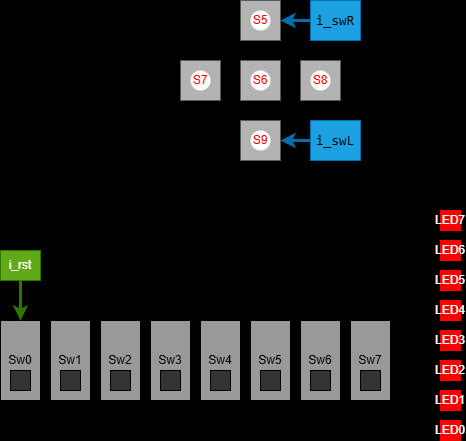

# PingPong 乒乓遊戲專案

## 專案簡介
本專案使用 VHDL 實作一個簡單的乒乓球遊戲。遊戲透過 LED 的移動來模擬球的運動，並使用開關（Switch）作為擊球控制器。

---

## 設計文件與圖示

### 1.架構圖
描述專案的整體模組設計與訊號連接。

> - **CLK_DIV**: 除頻器，將系統時鐘降頻以適合人類肉眼觀察 LED 移動。
> - **FSM**: 處理遊戲規則，判斷擊球時機、得分以及狀態切換。
> - **LED_P**: 根據FSM輸出的狀態控制 LED 的移動。
> - **Score_L_p**: 紀錄左球員分數。
> - **Score_R_p**: 紀錄右球員分數。
---

### 2.Break Down
將專案功能拆解為各個子模組或處理程序。

> - **MoveingR**:球往右移動
> - **MoveingL**:球往左移動
> - **Rwin**:右球員得分
> - **Lwin**:左球員得分
---

### 3.FSM
描述遊戲邏輯的狀態轉換，包含移動、得分與發球狀態。

---

### 4.AOV
描述異步操作或特定事件的觸發邏輯。

> [!NOTE]
> - 綠色路線為左邊發球，右邊漏接或者提早按下開關
> - 藍色路線為來回打了兩次後左邊漏接或提早按下開關
> - 紅色路線為右邊發球，左邊漏接或提早按下開關
---

### 5.MSC
描述各組件間的溝通與時序關係。

---

## 模擬成果

### 模擬結果 (原圖)
ModelSim 或 Vivado 模擬產生的波形圖。

.png)

---

### 模擬結果 (標示版)
標註了狀態切換與關鍵訊號變化的波形圖。

.png)

> - **紅色方框** : 預設向右發球
> - **紫色方框** : 右球員發球
> - **橙色方框** : 右球員提前擊球
> - **藍色方框** : 左球員發球
> - **灰色方框** : 右球員擊球
> - **黃色方框** : 右球員漏接

---

## 各腳位定義

---

## 實機展示

### 實機展示影片

### 實機運作 GIF 成果
以下為各項遊戲功能的實機運作 GIF 成果展示：

#### 1. 初始化隨機發球
在遊戲開始或重置時，系統會隨機選擇由左方或右方球員開始發球。

#### 2. 發球
球員按下擊球鍵進行發球，LED 開始朝向對手方向移動。

#### 3. 對打
兩位球員在球移動至最末端 LED 時，需在正確時機按下擊球鍵將球擊回。

#### 4. 分數顯示
當有球員漏接或提前擊球時，對手得分，七段顯示器會即時更新雙方得分。

#### 5. Game Over
當其中一位球員達到獲勝分數，遊戲結束，並顯示結束狀態。

