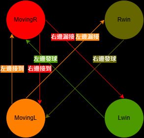
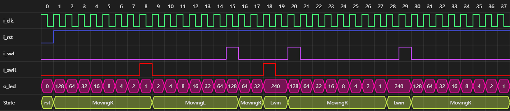

# PingPong 乒乓遊戲專案

## 專案簡介
本專案使用 VHDL 實作一個簡單的乒乓球遊戲。遊戲透過 LED 的移動來模擬球的運動，並使用開關（Switch）作為擊球控制器 。

---

## 設計文件與圖示

### 系統架構圖
描述專案的整體模組設計與訊號連接。

> - **CLK_DIV**: 除頻器，將系統時鐘降頻以適合人類肉眼觀察 LED 移動。
> - **FSM**: 處理遊戲規則，判斷擊球時機、得分以及狀態切換。
> - **LED_P**: 根據FSM輸出的狀態控制 LED 的移動。
> - **Score_L_p**: 紀錄左球員分數。
> - **Score_R_p**: 紀錄右球員分數。
---

- **亂數產生 (LFSR)**：
  - 使用 8-bit 線性回饋位移暫存器 (LFSR) 產生偽隨機數。
  - 每次球移動時，LFSR 會產生新的隨機值。

- **動態時脈除頻**：
  - 將原本固定的除頻計數器改為動態上限。
  - 計數上限值由 LFSR 的隨機輸出決定 (`SpeedLimit`)。
  - 加上基礎延遲 (`+2`) 以避免球速過快導致肉眼無法辨識。
  - 效果：球在移動過程中，每一步的時間間隔都會隨機變化，呈現忽快忽慢的效果。

---

### Break Down
將專案功能拆解為各個子模組或處理程序。

> - **MoveingR**:球往右移動
> - **MoveingL**:球往左移動
> - **Rwin**:右球員得分
> - **Lwin**:左球員得分
---

### 有限狀態機 (FSM)
描述遊戲邏輯的狀態轉換，包含移動、得分與發球狀態。

---

### 非週期操作 (AOV)
描述異步操作或特定事件的觸發邏輯。

---

### 訊息序列圖 (MSC)
描述各組件間的溝通與時序關係。

---

## 模擬成果

### 模擬結果 (原圖)
ModelSim 或 Vivado 模擬產生的波形圖。

.png)

---

### 模擬結果 (標示版)
標註了狀態切換與關鍵訊號變化的波形圖。

.png)
> - **隨機球速** : 可以看到slow_clk的波形隨機變化，且o_led的波形長短也不一樣
> - **紅色方框** : 預設向右發球
> - **灰色方框** : 右球員擊球
> - **黃色方框** : 右球員漏接
> - **藍色方框** : 左球員發球
> - **橙色方框** : 右球員提前擊球

