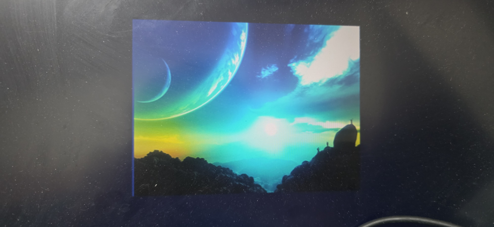

# VGA 影像顯示系統專案 (EGO-XZ7 & VGA 666)

本專案是一個基於 **EGO-XZ7 開發板 (Xilinx Zynq-7000 SoC xc7z020clg484-2)** 與 **Gert VGA 666 轉接板** 的 VGA 影像顯示系統。系統自 Block RAM IP 讀取一幅 $256 \times 256$ 的 24-bit 彩色影像，並在 640x480 @ 60Hz 螢幕上進行置中顯示。影像之外的顯示有效區會輸出深藍色背景，其餘非有效區為純黑色。

---

## 1. 專題介紹

本系統的架構亮點為**流水線時序對齊技術**。由於實體 Block RAM 讀取需要 2 個像素時脈延遲，加上接收端的輸入同步鎖存 1 拍，系統總共需要 3 個像素時脈 (25MHz) 的延遲。系統中設計了同步訊號的 3 拍延遲對齊邏輯，將 VGA 同步控制訊號也同步延遲 3 個像素時脈，確保影像色彩與掃描線位置完美對齊，避免影像產生邊緣位移或撕裂。

* **硬體平台**：EGO-XZ7 開發板。
* **VGA 輸出硬體**：Raspberry Pi 擴充介面 (CN3) 連接 Gert VGA 666 轉接板（採用分量電阻梯網路，每通道 6-bit 類比輸出）。
* **顯示規格**：640x480 @ 60Hz，像素時脈 25MHz。
* **影像規格**：$256 \times 256$ 解析度，儲存於 FPGA 內部的單埠 Block RAM 記憶體。

---

## 2. 需求定義

### 2.1 輸入/輸出埠定義
| 訊號名稱       |  I/O  | 位元寬度 |     物理腳位 (FPGA Pin)      | 說明                                             |
| :------------- | :---: | :------: | :--------------------------: | :----------------------------------------------- |
| `i_clk_r`      |   I   |    1     |              Y9              | 系統主時脈輸入 (100MHz)                          |
| `i_rst_r`      |   I   |    1     |             P16              | 同步重設 (高電位有效，板載中央按鍵 BTNC)         |
| `o_hSync_w`    |   O   |    1     |              W5              | VGA 水平同步訊號 (VGA666 GPIO 3)                 |
| `o_vSync_w`    |   O   |    1     |              Y5              | VGA 垂直同步訊號 (VGA666 GPIO 2)                 |
| `o_vgaRed_w`   |   O   |    6     |  U6, V4, T6, AA7, AB10, V5   | VGA 紅色色彩輸出 (6-bit，對應 VGA666 GPIO 21~16) |
| `o_vgaGreen_w` |   O   |    6     | AB11, AA11, R6, T4, AB6, Y11 | VGA 綠色色彩輸出 (6-bit，對應 VGA666 GPIO 15~10) |
| `o_vgaBlue_w`  |   O   |    6     |  Y10, AB4, AB7, AA4, Y4, Y6  | VGA 藍色色彩輸出 (6-bit，對應 VGA666 GPIO 9~4)   |

### 2.2 顯示時序參數 (640x480 @ 60Hz)
- **像素時脈**：25.175 MHz (本系統除頻實作採用 25.0 MHz)
- **水平時序 (Pixels)**：
  - 有效顯示區 (Active)：640
  - 前廊 (Front Porch)：16
  - 同步脈衝 (Sync Pulse)：96
  - 後廊 (Back Porch)：48
  - 掃描總計 (Total)：800
- **垂直時序 (Lines)**：
  - 有效顯示區 (Active)：480
  - 前廊 (Front Porch)：10
  - 同步脈衝 (Sync Pulse)：2
  - 後廊 (Back Porch)：33
  - 掃描總計 (Total)：525

---

## 3. Breakdown (階層分解)

系統由頂層模組 [top.vhd](file:///z:/VMshare/hardware_test/7/7/7.srcs/sources_1/new/top.vhd) 封裝，並實例化 [vgaController.vhd](file:///z:/VMshare/hardware_test/7/7/7.srcs/sources_1/imports/7/vgaController.vhd) 與 [imageDisplay.vhd](file:///z:/VMshare/hardware_test/7/7/7.srcs/sources_1/imports/7/imageDisplay.vhd) 作為其子模組。`top.vhd` 負責 100MHz 至 25MHz 的時脈除頻，並將兩個子模組相互接線連接。

* 圖檔與圖片連結：[breakdown.drawio](./img/breakdown.drawio) (已建立，黑色背景)

### 3.1 樹狀階層結構

---

## 4. RTL 架構圖

[RTL 架構與資料流圖](./img/architecture.drawio) 展示了模組之間的訊號互連、外部接腳以及控制流與資料流。

* 圖檔與圖片連結：[architecture.drawio](./img/architecture.drawio) (已建立，黑色背景)

---

## 5. MSC 信號時序波形與循序圖 (Message Sequence)

本專案提供了以下三份時序與訊號循序驗證圖檔：

1. **vgaController 內部循序圖 (MSC)**：[MSC_vgaController.drawio](./img/MSC_vgaController.drawio) (已建立，黑色背景)，展現了控制器內部的四個 Process 之間的座標傳遞與拉低/拉高同步脈衝。
   

2. **頂層架構循序圖 (MSC)**：[MSC.drawio](./img/MSC.drawio) (已建立，黑色背景)，依照 [architecture.drawio](./img/architecture.drawio) 頂層結構設計。展現了本專案實際的 $256 \times 256$ 置中影像顯示時序與 3 clk Pipeline 延遲。
   

### 5.1 精確時序追蹤表 (10個像素時脈週期)
本表展示系統在**重設釋放、正常掃描工作狀態下**，水平掃描線掃過影像左邊界 $X = 192$ 這一瞬間的 Pipeline 延遲與對齊細節。`T0 ~ T9` 直接代表**連續的像素時脈上升沿週期 (Rising Edge Cycles)**：

* **`T0`**：掃描線尚未進入影像區域（`i_pixelX_r` = 190），輸入鎖存訊號 `v_pixelXReg_r` 為 189。
* **`T1`**：掃描線抵達左邊界（`i_pixelX_r` = 191 $\rightarrow$ 192）。此時 `v_pixelXReg_r` 仍為 190。
* **`T2`**：輸入鎖存生效，`v_pixelXReg_r` 變為 191 $\rightarrow$ 192。位址計算組合邏輯 `v_romAddr_w` 即時變為首個位址 **`A0`**。
* **`T3 (第 1 拍延遲)`**：`v_inImageRegion_r` 暫存器在此刻變為 **`1`**（延遲自 `v_pixelXReg_r = 192`）；BRAM 鎖存位址 `A0` 開始讀取。
* **`T4 (第 2 拍延遲)`**：BRAM 第二級暫存器讀出第一個像素資料 **`D0`**；對齊邏輯對影像區域判定再打一拍暫存器（`v_inImageRegionDelay_r = 1`）。
* **`T5 (第 3 拍延遲)`**：在 `T1` 觸發的影像資料在延遲 3 clk 後，最終對齊輸出第一像素色彩 **`R0`**。

| 訊號名稱 \ 時脈週期 (上升沿)        |  T0   |  T1   |  T2   |   T3   |  T4   |   T5   |  T6   |  T7   |  T8   |  T9   |
| :---------------------------------- | :---: | :---: | :---: | :----: | :---: | :----: | :---: | :---: | :---: | :---: |
| **`i_pixelX_r` (控制器座標)**       |  190  |  191  |  192  |  193   |  194  |  195   |  196  |  197  |  198  |  199  |
| **`v_pixelXReg_r` (鎖存座標)**      |  189  |  190  |  191  |  192   |  193  |  194   |  195  |  196  |  197  |  198  |
| **`v_romAddr_w` (ROM 組合位址)**    |   0   |   0   |   0   | **A0** |  A1   |   A2   |  A3   |  A4   |  A5   |  A6   |
| **`v_inImageRegion_r` (區域暫存)**  |   0   |   0   |   0   |   0    | **1** |   1    |   1   |   1   |   1   |   1   |
| **`v_romData_w` (BRAM 輸出資料)**   |   0   |   0   |   0   |   0    |   0   | **D0** |  D1   |  D2   |  D3   |  D4   |
| **`v_inImageRegionDelay_r` (對齊)** |   0   |   0   |   0   |   0    |   0   | **1**  |   1   |   1   |   1   |   1   |
| **`o_vgaRed_w` (色彩輸出埠)**       |   0   |   0   |   0   |   0    |   0   | **R0** |  R1   |  R2   |  R3   |  R4   |

---

## 6. AOV 活動狀態軌跡與統計圖

AOV 圖展示了系統掃描與畫面色彩顯示的活動流程、輸入輸出以及週期權重。

* 圖檔與圖片連結：[aov.drawio](./img/aov.drawio) (已建立，黑色背景，包含下方動作說明表格)

### 6.1 AOV 動作說明表格
| 動作  | 動作說明                                                     | 時間 (clocks) 與計算算式                                         | 輸入                                | 輸出               |
| :---: | :----------------------------------------------------------- | :--------------------------------------------------------------- | :---------------------------------- | :----------------- |
| **A** | 進行水平掃描與垂直掃描 共 $800 \times 525$ 個像素            | $800 \text{ (水平總長)} \times 525 \text{ (垂直總高)} = 420,000$ | `i_clk`                             | `h_count, v_count` |
| **B** | 顯示每幀畫面之影像圖片 (於影像區) 共 $256 \times 256$ 個像素 | $256 \text{ (影像寬)} \times 256 \text{ (影像高)} = 65,536$      | `i_clk, h_count, v_count, rom_data` | `red, green, blue` |

---

## 7. 模擬結果

### 7.1 模擬波形圖展示

### 7.2 為什麼水平同步與色彩輸出會延遲 3 clk？
在整個系統中，影像色彩輸出與同步訊號皆向後延遲了 **`3 clk`**。這來自於 **3 級暫存器打拍 (Pipeline Stage)**：
* **第 1 拍延遲 (輸入鎖存)**：
  - `REG_INPUT` process 在時脈上升沿同步鎖存來自 `vgaController` 的所有坐標與同步控制訊號。
* **第 2 拍延遲 (位址解碼與區域鎖存)**：
  - 影像區域判定由 `REGION_PROC` 鎖存，產生 `v_inImageRegion_r`。
  - 同時，BRAM 第一級讀取鎖存位址 `v_romAddr_w`。
* **第 3 拍延遲 (BRAM 輸出與最終對齊)**：
  - 實體 BRAM 具有 2 拍讀取延遲，於此刻輸出 `D0`。
  - 頂層 `DELAY_ALIGN` process 對同步訊號與顯示有效訊號再打一拍暫存器對齊 BRAM，使其精準輸出。
* **結論**：影像與同步訊號均在時間軸上精準向後對齊 3 拍，徹底消除了影像左側由於跨模組時序抖動而產生的亮藍/亮綠邊緣線，實現了像素無位移對齊。

### 7.3 影像邊界藍/綠亮線問題解決說明

#### 7.3.1 問題說明
在實體 FPGA 螢幕測試中，影像的左側邊界會出現一條明顯的亮綠色或亮藍色垂直亮線（其顏色與 Block RAM 中第一個像素點的色彩相同，例如跑車圖為亮綠色，太空圖為亮青色）。

這是典型的**時序對齊偏移問題**：
- **Block RAM 讀出延遲**：實體 Block RAM IP 由於內部 Core 鎖存位址與設定了輸出暫存器（Output Register），從輸入位址到穩定資料輸出總共需要 **2 拍延遲**。加上頂層輸入同步鎖存的 **1 拍延遲**，影像像素資料從判定起點到實際輸出共經歷了 **3 拍延遲**。
- **控制訊號對齊不匹配**：若同步訊號與影像有效顯示區判定訊號僅進行 2 拍的延遲打拍對齊，這些控制訊號會比 Block RAM 資料**提早 1 拍**進入影像有效顯示區。
- **亮線成因**：當控制訊號提早 1 拍生效時，Block RAM 尚未輸出影像的第一個像素資料（仍為上一個時脈週期的值，即位址 0 的舊資料）。這導致在螢幕影像顯示區的最左側第一個像素列上，讀出了重複的 Block RAM 首位址資料，從而在螢幕上形成了一條明顯的垂直邊界亮線。

#### 7.3.2 解決方法
為了解決此時序偏移問題，必須使控制訊號的對齊打拍與 Block RAM 資料的輸出在時間軸上完美同步：
1. **調整對齊打拍為 3 拍**：在 [imageDisplay.vhd](file:///z:/VMshare/hardware_test/7/7/7.srcs/sources_1/imports/7/imageDisplay.vhd) 中，調整對齊延遲暫存器，在 `DELAY_ALIGN` 中實作兩級打拍鎖存 `v_hSyncDelay2_r`、`v_vSyncDelay2_r`、`v_videoActiveDelay2_r`，連同頂層輸入鎖存的 1 拍，使所有控制訊號的對齊延遲達到 **3 拍**。
2. **影像區域判定延遲**：影像區域判定訊號 `v_inImageRegion_r` 也同步再延遲 1 拍，變為 `v_inImageRegionDelay_r`（共 3 拍延遲）。
3. **色彩控制同步輸出**：在色彩控制邏輯中，色彩輸出與同步訊號直接使用這組延遲 3 拍的控制訊號進行多工輸出，確保影像像素與掃描線在時間上完全重合。

當對齊延遲精準更新為 3 拍後，影像的每一行的第一個像素能被精準顯示在第一個顯示列，亮線現象徹底消失，邊界過渡乾淨俐落。

* 影像邊界線條問題解決對照圖：
  

  .jpg)
---

## 8. 成果展示

<table>
  <tr>
    <td align="center"><b>成果展示原圖</b> </td>
    <td align="center"><b>FPGA 實體螢幕成果展示</b> </td>
  </tr>
</table>

