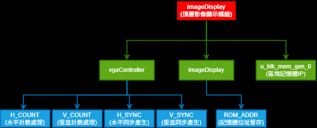
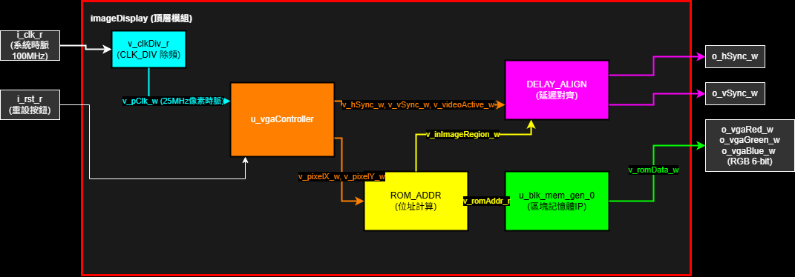
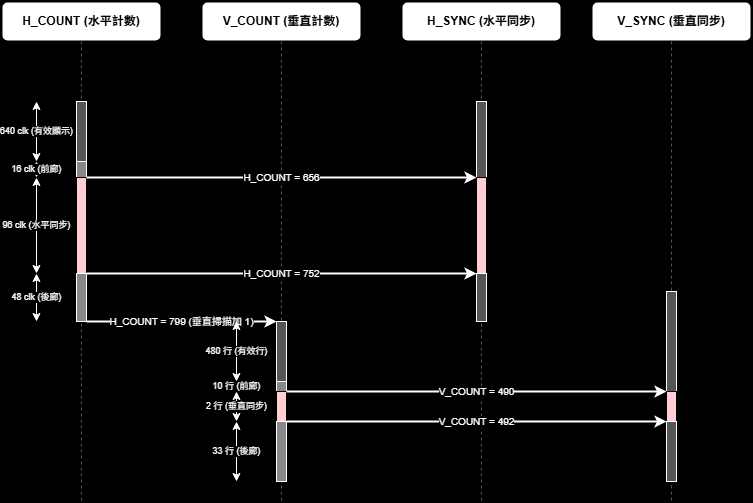
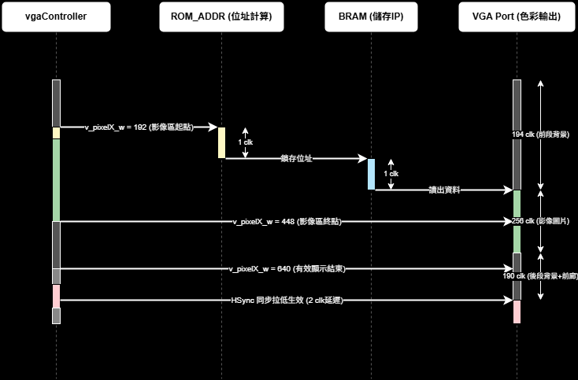
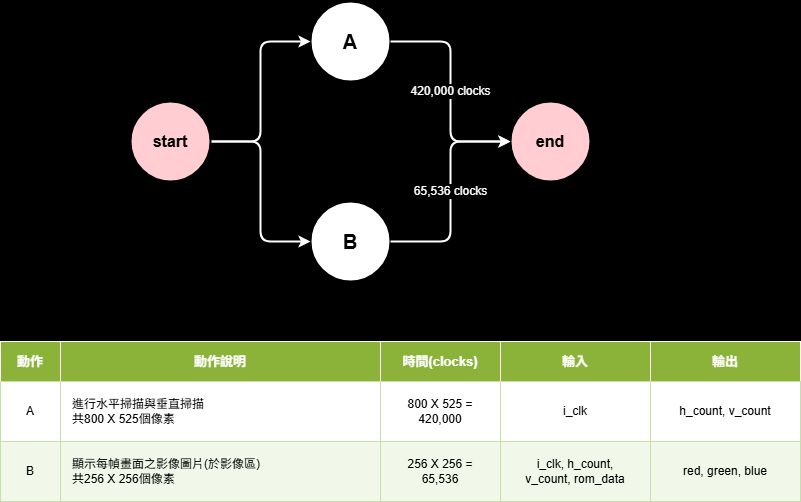
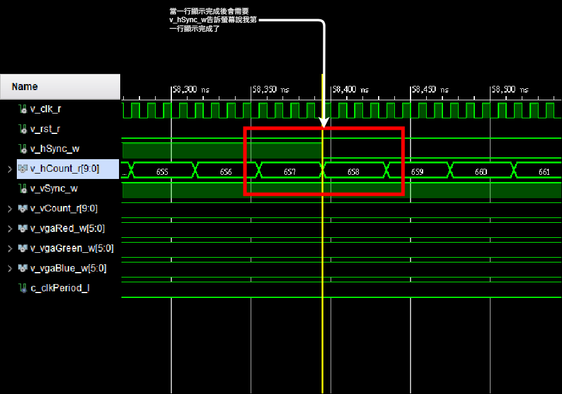
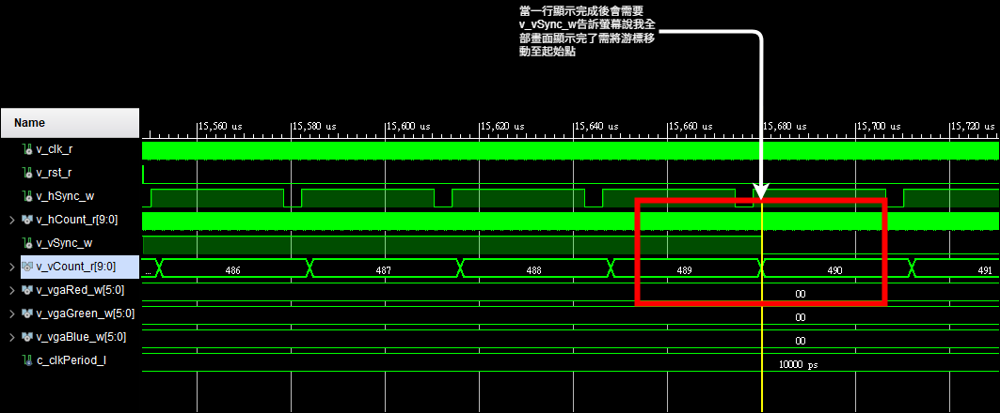
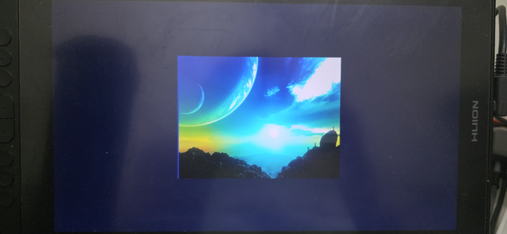

# VGA 影像顯示系統專案 (EGO-XZ7 & VGA 666)

本專案是一個基於 **EGO-XZ7 開發板 (Xilinx Zynq-7000 SoC xc7z020clg484-2)** 與 **Gert VGA 666 轉接板** 的 VGA 影像顯示系統。系統自 Block RAM IP 讀取一幅 $256 \times 256$ 的 24-bit 彩色影像，並在 640x480 @ 60Hz 螢幕上進行置中顯示。影像之外的顯示有效區會輸出深藍色背景，其餘非有效區為純黑色。

---

## 1. 專題介紹

本系統的架構亮點為**流水線時序對齊技術**。由於 Block RAM 讀取需要 1 個像素時脈 (25MHz) 的延遲，系統中設計了同步訊號的延遲對齊邏輯，將 VGA 同步控制訊號也同步延遲 1 個像素時脈，確保影像色彩與掃描線位置完美對齊，避免影像產生邊緣位移或撕裂。

* **硬體平台**：EGO-XZ7 開發板。
* **VGA 輸出硬體**：Raspberry Pi 擴充介面 (CN3) 連接 Gert VGA 666 轉接板（採用分量電阻梯網路，每通道 6-bit 類比輸出）。
* **顯示規格**：640x480 @ 60Hz，像素時脈 25MHz。
* **影像規格**：$256 \times 256$ 解析度，儲存於 FPGA 內部的單埠 Block RAM 記憶體。

---

## 2. 需求定義

### 2.1 輸入/輸出埠定義
| 訊號名稱 | I/O | 位元寬度 | 物理腳位 (FPGA Pin) | 說明 |
| :--- | :---: | :---: | :---: | :--- |
| `i_clk_r` | I | 1 | Y9 | 系統主時脈輸入 (100MHz) |
| `i_rst_r` | I | 1 | P16 | 同步重設 (高電位有效，板載中央按鍵 BTNC) |
| `o_hSync_w` | O | 1 | W5 | VGA 水平同步訊號 (VGA666 GPIO 3) |
| `o_vSync_w` | O | 1 | Y5 | VGA 垂直同步訊號 (VGA666 GPIO 2) |
| `o_vgaRed_w` | O | 6 | U6, V4, T6, AA7, AB10, V5 | VGA 紅色色彩輸出 (6-bit，對應 VGA666 GPIO 21~16) |
| `o_vgaGreen_w`| O | 6 | AB11, AA11, R6, T4, AB6, Y11 | VGA 綠色色彩輸出 (6-bit，對應 VGA666 GPIO 15~10) |
| `o_vgaBlue_w` | O | 6 | Y10, AB4, AB7, AA4, Y4, Y6 | VGA 藍色色彩輸出 (6-bit，對應 VGA666 GPIO 9~4) |

### 2.2 顯示時序參數 (640x480 @ 60Hz)
- **像素時脈**：25.175 MHz (本系統除頻實作採用 25.0 MHz)
- **水平時序 (Pixels)**：
  - 有效顯示區 (Active)：640
  - 前廊 (Front Porch)：16
  - 同步脈衝 (Sync Pulse)：96
  - 後廊 (Back Porch)：48
  - 掃描總計 (Total)：800
- **垂直時序 (Lines)**：
  - 有效顯示區 (Active)：480
  - 前廊 (Front Porch)：10
  - 同步脈衝 (Sync Pulse)：2
  - 後廊 (Back Porch)：33
  - 掃描總計 (Total)：525

---

## 3. Breakdown (階層分解)

系統由頂層模組 [imageDisplay.vhd](file:///z:/VMshare/hardware_test/7/7/7.srcs/sources_1/imports/7/imageDisplay.vhd) 封裝，內部細分除頻、VGA 時序控制、位址計算、BRAM 儲存與流水線延遲等五大區塊。

* 圖檔與圖片連結：[breakdown.drawio](./img/breakdown.drawio) (已建立，黑色背景)

### 3.1 樹狀階層結構

---

## 4. RTL 架構圖

[RTL 架構與資料流圖](./img/architecture.drawio) 展示了模組之間的訊號互連、外部接腳以及控制流與資料流。

* 圖檔與圖片連結：[architecture.drawio](./img/architecture.drawio) (已建立，黑色背景)

---

## 5. FSM 狀態轉移圖

雖然 VGA 控制器是以水平與垂直計數器驅動，但其工作流程本質上可對應為**時序狀態機 (FSM)**。下圖展示了水平同步訊號的時序切換邏輯。

由於本專案以連續像素計數器無縫累加取代複雜狀態機，VGA 的水平行時序狀態轉移（有效顯示區 $\rightarrow$ 前廊 $\rightarrow$ 同步 $\rightarrow$ 後廊）已完整呈現於下一節的 [vgaController 內部循序圖 (MSC_vgaController.drawio)](#6-msc-信號時序波形與循序圖-message-sequence) 中，請參閱該時序圖的分段。
---

## 6. MSC 信號時序波形與循序圖 (Message Sequence)

本專案提供了以下三份時序與訊號循序驗證圖檔：

1. **vgaController 內部循序圖 (MSC)**：[MSC_vgaController.drawio](./img/MSC_vgaController.drawio) (已建立，黑色背景)，展現了控制器內部的四個 Process 之間的座標傳遞與拉低/拉高同步脈衝。
   

2. **頂層架構循序圖 (MSC)**：[MSC.drawio](./img/MSC.drawio) (已建立，黑色背景)，依照 [architecture.drawio](./img/architecture.drawio) 頂層結構設計。展現了本專案實際的 $256 \times 256$ 置中影像顯示時序與 2 clk Pipeline 延遲。
   

### 5.1 精確時序追蹤表 (10個像素時脈週期)
本表展示系統在**重設釋放、正常掃描工作狀態下**，水平掃描線掃過影像左邊界 $X = 192$ 這一瞬間的 Pipeline 延遲與對齊細節。`T0 ~ T9` 直接代表**連續的像素時脈上升沿週期 (Rising Edge Cycles)**：

* **`T0 ~ T1`**：掃描線尚未進入影像區域（`v_pixelX_w` = 190 ~ 191），影像區域判定信號 `v_inImageRegion_w` 為 `0`。
* **`T2`**：掃描線抵達左邊界（`v_pixelX_w` = 192），`v_inImageRegion_w` 拉高變為 `1`。
* **`T3 (第 1 拍延遲)`**：經歷 1 clk 位址計算延遲，`ROM_ADDR` 位址計算單元鎖存 ROM 起始位址為 **`0`**（`v_romAddr_r = 0`）。
* **`T4 (第 2 拍延遲)`**：經歷 BRAM 讀取 1 clk 延遲，BRAM 輸出第一個像素資料 **`D0`**（`v_romData_w = D0`）；同時，影像區域對齊信號打 2 拍後在此刻生效（`v_inImageRegionDelay_r(1) = 1`）。兩者完美重合，最終輸出第一像素色彩 **`R0`**。
* **`T5 ~ T9`**：像素流水線持續往右無縫遞增推移。

| 訊號名稱 \ 時脈週期 (上升沿) | T0 | T1 | T2 | T3 | T4 | T5 | T6 | T7 | T8 | T9 |
| :--- | :---: | :---: | :---: | :---: | :---: | :---: | :---: | :---: | :---: | :---: |
| **`v_pixelX_w` (水平計數器)** | 190 | 191 | 192 | 193 | 194 | 195 | 196 | 197 | 198 | 199 |
| **`v_inImageRegion_w` (區域判定)**| 0 | 0 | **1** | 1 | 1 | 1 | 1 | 1 | 1 | 1 |
| **`v_romAddr_r` (ROM 位址暫存)** | 0 | 0 | 0 | **0** | 1 | 2 | 3 | 4 | 5 | 6 |
| **`v_romData_w` (BRAM 輸出資料)** | 0 | 0 | 0 | 0 | **D0**| D1 | D2 | D3 | D4 | D5 |
| **`v_inImageRegionDelay_r(1)` (區域對齊)**| 0 | 0 | 0 | 0 | **1** | 1 | 1 | 1 | 1 | 1 |
| **`o_vgaRed_w` (色彩輸出埠)** | 0 | 0 | 0 | 0 | **R0**| R1 | R2 | R3 | R4 | R5 |

---

## 7. AOV 活動狀態軌跡與統計圖

AOV 圖展示了系統掃描與畫面色彩顯示的活動流程、輸入輸出以及週期權重。

* 圖檔與圖片連結：[aov.drawio](./img/aov.drawio) (已建立，黑色背景，包含下方動作說明表格)

### 7.1 AOV 動作說明表格
| 動作 | 動作說明 | 時間 (clocks) 與計算算式 | 輸入 | 輸出 |
| :---: | :--- | :--- | :--- | :--- |
| **A** | 進行水平掃描與垂直掃描 共 $800 \times 525$ 個像素 | $800 \text{ (水平總長)} \times 525 \text{ (垂直總高)} = 420,000$ | `i_clk` | `h_count, v_count` |
| **B** | 顯示每幀畫面之影像圖片 (於影像區) 共 $256 \times 256$ 個像素 | $256 \text{ (影像寬)} \times 256 \text{ (影像高)} = 65,536$ | `i_clk, h_count, v_count, rom_data` | `red, green, blue` |

---

## 8. 模擬結果

### 8.1 模擬波形圖展示

### 8.2 為什麼水平同步與色彩輸出會延遲 2 clk？
在整個系統中，影像色彩輸出與同步訊號皆向後延遲了 **`2 clk`**。這來自於 **2 級暫存器打拍 (Pipeline Stage)**：
* **第 1 拍延遲**：
  - `ROM_ADDR` process 在時脈上升沿鎖存位址（$X=192$ 跨入影像區，下一拍 $X=193$ 寫入位址 `0`）。
  - 控制器 `H_SYNC` process 亦在上升沿打拍產生同步訊號，推遲 1 拍在 $X=657$ 產生低電位。
* **第 2 拍延遲**：
  - BRAM 讀取需要 1 clk 讀取延遲，於 $X=194$ 輸出第一個像素資料 `D0`。
  - 頂層 `DELAY_ALIGN` process 對同步訊號再打一拍暫存器對齊 BRAM，使其於 $X=658$ 的上升沿拉低。
* **結論**：影像與同步訊號均在時間軸上精準向後對齊 2 拍，在 $X=194$ 處開始無偏移地顯示第一個像素。

---

## 9. 成果展示

<table>
  <tr>
    <td align="center"><b>成果展示原圖</b> </td>
    <td align="center"><b>FPGA 實體螢幕成果展示</b> </td>
  </tr>
</table>

