# 基於 VGA 顯示之 Atari Pong 遊戲設計

本專案以 VHDL 實作經典的 Atari Pong 雙人對戰乒乓球遊戲，並透過 VGA 介面進行畫面渲染與顯示。系統具備雙人擋板控制、物理碰撞反射、出界計分以及 3 分勝利判定之完整遊戲邏輯與狀態機。

---

## 1. 專題介紹
Atari Pong 是一款雙人乒乓球遊戲。玩家各自控制左、右兩側的擋板進行上下移動，以防乒乓球越過防線。球體會在接觸上下牆壁或玩家擋板時反彈，若球體超出左或右邊界，則代表防守失敗，對方玩家得分。最先得到 3 分的玩家即獲得該局勝利。

---

## 2. 需求定義
1. **顯示規格**：VGA 640x480 @ 60Hz 影像輸出，時脈 25 MHz。
2. **控制輸入**：左玩家上下移動按鍵、右玩家上下移動按鍵。
3. **物理碰撞**：球體邊界反彈（上下牆壁）、球體擋板反彈（左、右擋板）。
4. **計分功能**：當球出界時，對手得分加 1，畫面顯示最新分數，並暫停約 1 秒後重開球。
5. **勝利判定**：任一玩家的分數達到 3 分時，遊戲自動結束，進入勝利狀態，在畫面中央高亮顯示贏家宣告。

---

## 3. Breakdown 樹狀階層分解圖

系統內部各模組之層級結構如下：
- `pongGameTop` (頂層模組)
  - `clkDivider` (時脈除頻模組，產生像素時脈致能訊號 `o_pixelEn`)
  - `vgaController` (VGA 控制器，產生 `HSYNC` / `VSYNC` 與像素 X/Y 座標)
  - `gameLogic` (遊戲控制核心，包含 FSM、碰撞偵測與位置更新)
  - `videoGenerator` (畫面著色與文字/分數渲染)

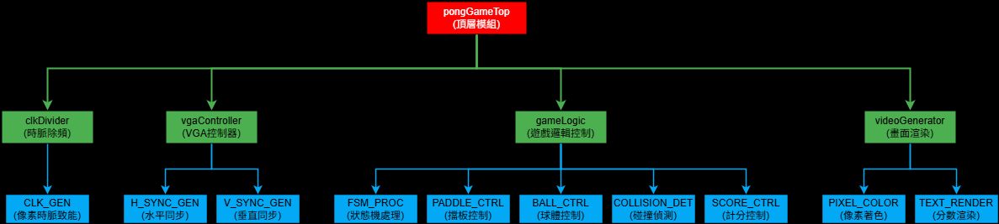

---

## 4. RTL 架構圖

本系統內部各子模組的連接關係、外部接腳及資料/控制流向如下圖所示：

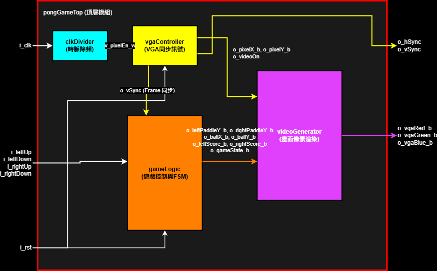

### 各子模組內部電路架構圖

1. **clkDivider (時脈除頻)**：
   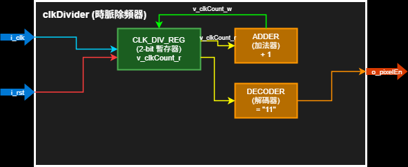
2. **vgaController (VGA控制器)**：
   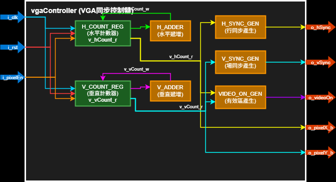
3. **gameLogic (遊戲控制與碰撞核心)**：
   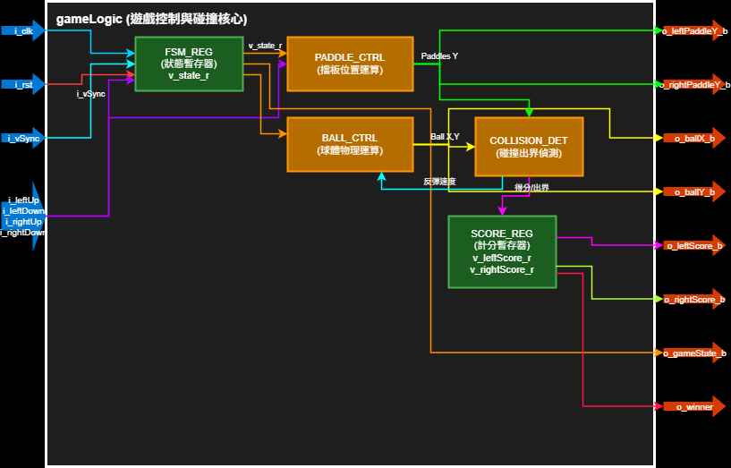
4. **videoGenerator (畫面渲染與混合)**：
   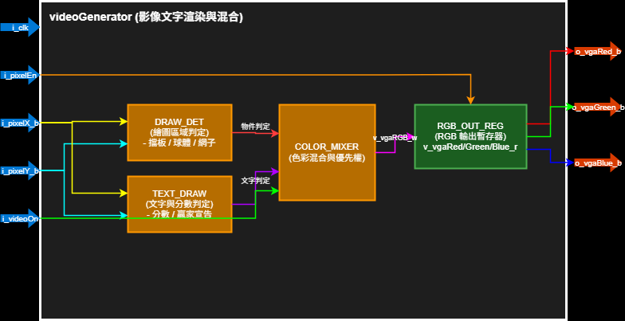

---

## 5. FSM 有限狀態機狀態轉移圖

`gameLogic` 模組透過以下有限狀態機管理遊戲流程：
* **ST_IDLE (00)**：等待狀態。按任意控制鍵以啟動遊戲。
* **ST_PLAY (01)**：遊戲進行狀態。球體移動，玩家可控制擋板。
* **ST_SCORE (10)**：得分暫停狀態。球置中，延遲約 1 秒後重新發球。
* **ST_OVER (11)**：遊戲結束狀態。顯示 WINNER 畫面，按任意鍵可回到 `ST_IDLE`。

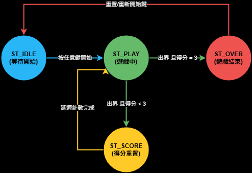

---

## 6. MSC 圖 (Message Sequence Chart)

本系統在模擬球拍擊球（得分/反彈）的關鍵時間點，各硬體模組之間的訊息傳遞與運算延遲時序如下圖（可參閱 [msc.drawio](./img/msc.drawio)）：

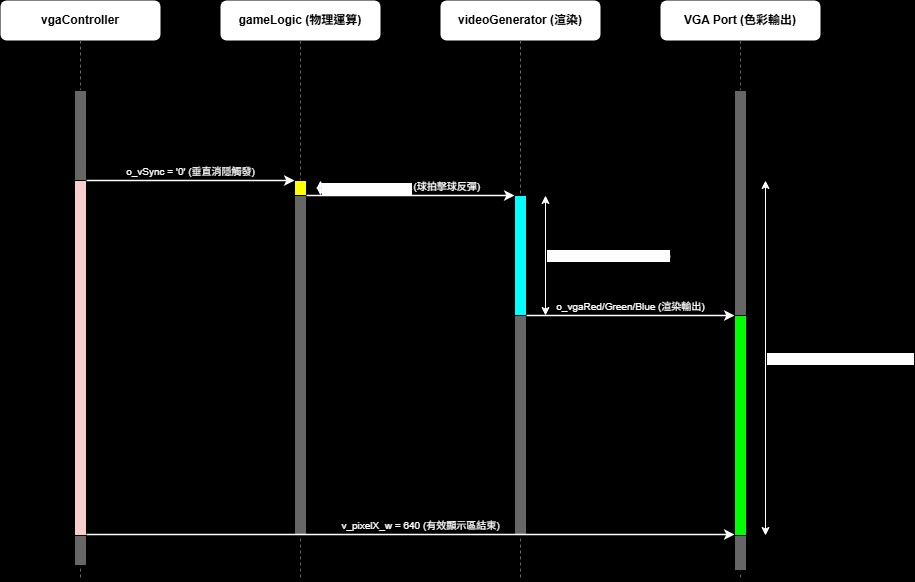

Atari Pong 擊球時序與運算延遲關鍵說明：
1. **消隱信號觸發物理更新 (vgaController → gameLogic)**：
   當 `vgaController` 掃描完一個完整的影像幀並進入垂直消隱區間時，會將場同步訊號 `o_vSync` 拉低。此下降沿會觸發 `gameLogic` 啟動，進行新一幀的球體位置更新與碰撞偵測運算。
2. **物理碰撞運算延遲 (gameLogic 內部，耗時 1 clk)**：
   `gameLogic` 模組在 `1 clk`（系統主時脈 10ns）的時間內，計算出球體與右擋板重合，發生碰撞，進而將球體水平速度寫入值更新為 `o_ballVx_b = -4` (朝左反彈)，並將最新的球體座標傳遞給 `videoGenerator`。
3. **色彩渲染與流水線延遲 (videoGenerator → VGA Port，耗時 8 clk)**：
   `videoGenerator` 接收到球體新座標後，開始計算該像素的顏色渲染優先權。因為運算時脈採用 `i_pixelEn`（25MHz，即 4 clk 週期），所以 2 級像素暫存延遲在 100MHz 系統主時脈下，實質共產生了 **8 個時脈週期 (8 clk) 的流水線延遲**，隨後將渲染後的 RGB 顏色數據送達 `VGA Port`。
4. **VGA 輸出端畫面刷新 (videoGenerator → VGA Port，耗時 1.67 × 10^6 clk)**：
   由於物理位置是基於幀更新，因此每次在螢幕上看到球體反彈的最新位置刷新，整體物理計算與顯示週期為 1 幀（在 100MHz 系統時脈下，約為 **1.67 × 10^6 clk** 週期，即 16.67 ms）。

---

## 7. AOV 圖 (Activity On Vertex)

本圖統計了典型遊戲局中（左玩家以 3:1 擊敗右玩家），各狀態被經過之路徑與次數權重：

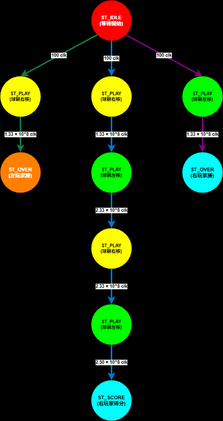

---

## 8. 如何驗證

### 模擬驗證 (Sim_Simulation)
* 測試平台代碼位於 [pongGameTop_tb.vhd](./pongGameTop_tb.vhd)。
* 透過模擬激勵按鍵輸入以啟動遊戲與移動擋板。
* 觀察 VGA 同步訊號 `o_hSync` 與 `o_vSync` 是否符合標準時序規格。

#### 模擬結果波形展示

1. **水平同步訊號模擬結果** (hSync 週期與拉低點符合 VGA 640x480 @ 60Hz 規範)：
   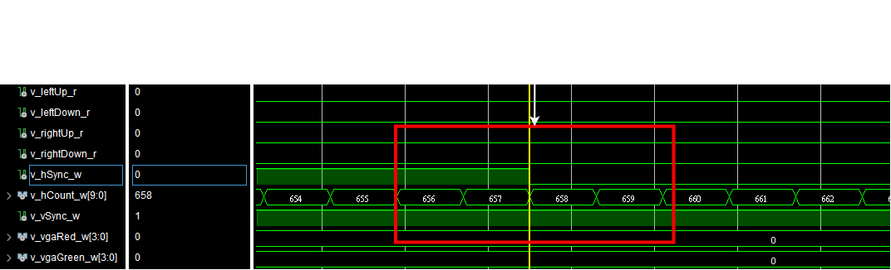
2. **垂直同步訊號模擬結果** (vSync 週期符合規格)：
   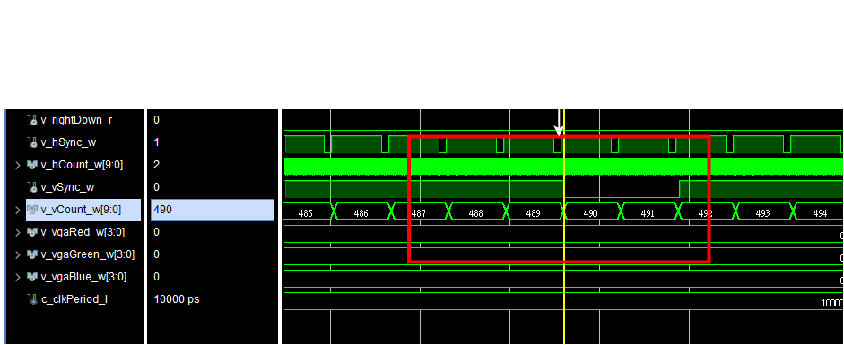
3. **球拍擊球與球體位置模擬結果** (球體 Y 軸座標 `v_ballY_w` 隨幀更新成功移動，且順利完成球拍截擊與碰撞反彈)：
   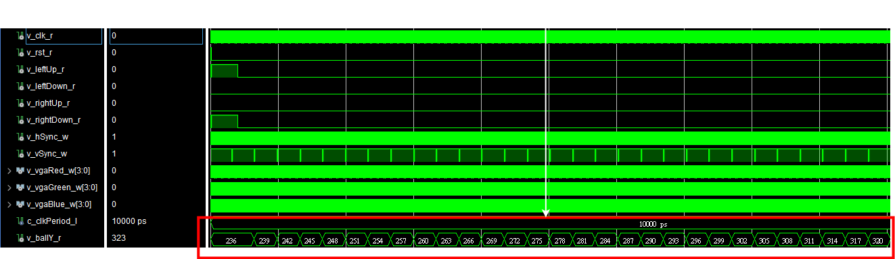

### 板端驗證
1. 將設計檔案導入 Vivado 專案 [8.xpr](./8.xpr)。
2. 配置對應開發板的 XDC 約束檔案（分配 i_clk, i_rst, i_leftUp, i_leftDown, i_rightUp, i_rightDown, o_hSync, o_vSync 以及 RGB 輸出腳位）。
   *板端各腳位定義與指派如下圖所示：*
   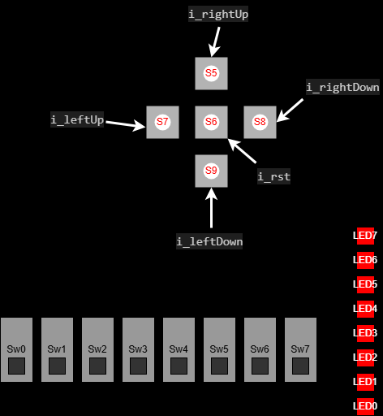
3. 執行綜合（Synthesis）、實現（Implementation）並產生 Bitstream。
4. 下載至 FPGA 晶片，連接 VGA 螢幕與按鍵進行實機對戰測試。

---

## 9. 成果展示

* **實機運行成果影片**：
[Atari Pong 實機對戰成果展示影片 (YouTube)](https://youtu.be/-eQrPqZSjfI)。
