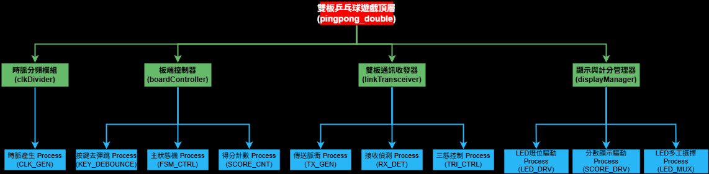
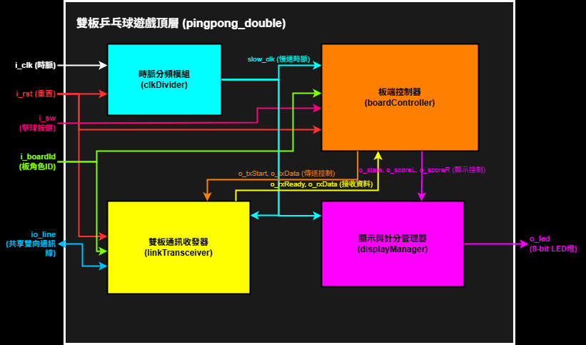
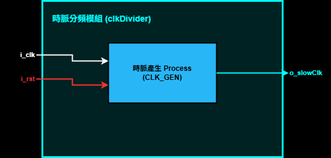
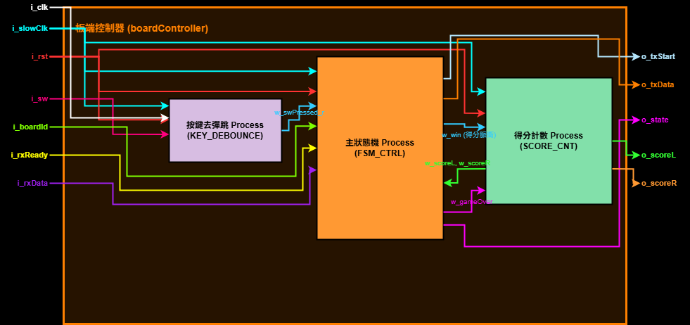
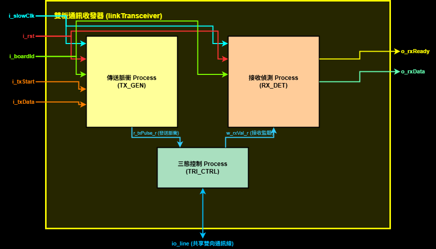
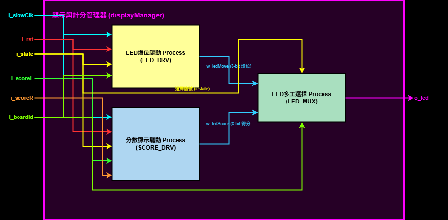
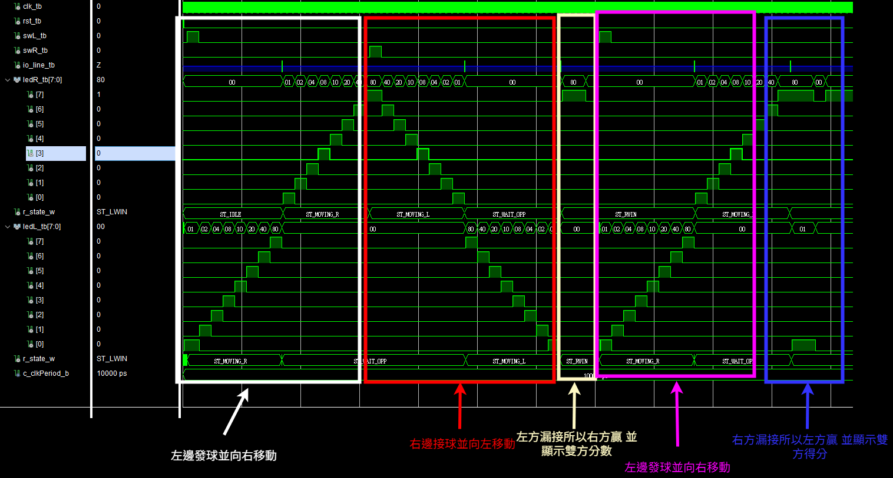
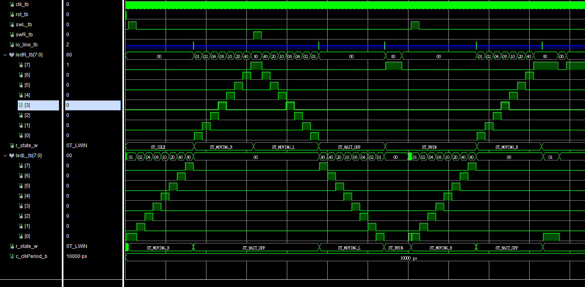

# 雙板 FPGA 16-bit LED 乒乓球遊戲 (雙板乒乓球)

本專案透過兩張 FPGA 開發板以單線雙向 `inout` 溝通線進行訊號通訊，共同組合構成一個 16-bit LED 乒乓球遊戲。兩板採用同一套程式邏輯，並透過 `i_boardId` 動態設定硬體角色，以極簡的實體接線完成高速且可靠的遊戲交互。

---

## 1. 專題介紹

本專案利用兩張 FPGA 開發板（左板與右板）的 8-bit LED 燈，組合成 16-bit 的乒乓球行進軌道。兩張板子之間透過一條 `inout` 共享單線進行電平脈衝通訊。球移出板子邊界時，會透過脈衝將球權傳送給對方。玩家必須在球到達端點時準確按下擊球按鍵擊球反彈，否則將判定為漏球使對手得分。先得 8 分者獲勝，贏方會閃爍三次 `11111111` 後自動重置分數並重新開始。

---

## 2. 需求定義

### I/O 腳位定義 (遵循 RULE[user_global] 變數命名規範)
*   **`i_clk`** (輸入)：系統時脈 (50MHz)。
*   **`i_rst`** (輸入)：同步重置鍵 (高電平有效)。
*   **`i_sw`** (輸入)：玩家擊球/發球按鍵 (左板與右板各接一個按鍵)。
*   **`i_boardId`** (輸入)：板子角色識別ID，`'0'` 代表左板，`'1'` 代表右板。
*   **`io_line`** (雙向)：共享雙板單線通訊線，採三態閘（Tristate buffer）作傳送與接收隔離，避免自發自收。
*   **`o_led`** (輸出)：8-bit LED 燈位輸出，顯示球位、比分或結局閃爍特效。

### 遊戲規則
*   **球權移動**：球在板子內以 0.5 秒一格的速度位移。出界時透過 `io_line` 傳送脈衝，對方板子監聽到脈衝後在端點無縫點亮接續位移。
*   **擊球防守**：球到達板子端點（Step 7）時，玩家必須在球停留的 0.5 秒期間內按下按鍵成功反彈，否則判定漏球。
*   **得分與結局**：玩家漏接或提早按鍵得分時，雙方顯示比分 1 秒，全滅 0.5 秒後由輸方在起點發球。達到 8 分者獲勝，贏家閃爍三次並清零比分重啟遊戲。

---

## 3. Breakdown 樹狀階層分解

本專案採用結構化設計，分解為 4 個子模組與 10 個核心 Process：

### 樹狀階層分解圖

*   編輯檔連結：[breakdown.drawio](img/breakdown.drawio)

```
頂層模組 (pingpong_double)
 ├── 時脈分頻模組 (clkDivider)
 │    └── CLK_GEN: 產生 100Hz 同步慢速時脈
 ├── 板端控制器 (boardController)
 │    ├── KEY_DEBOUNCE: 機械按鍵去彈跳
 │    ├── FSM_CTRL: 遊戲核心有限狀態機
 │    └── SCORE_CNT: 得分計數與結局歸零
 ├── 雙板通訊收發器 (linkTransceiver)
 │    ├── TX_GEN: 脈衝發送產生器
 │    ├── RX_DET: 接收訊號監聽與解碼
 │    └── TRI_CTRL: 雙向通訊線三態控制緩衝
 └── 顯示與計分管理器 (displayManager)
      ├── LED_DRV: LED 燈號位移驅動
      ├── SCORE_DRV: 得分燈號映射
      └── LED_MUX: 顯示多工選擇輸出
```

---

## 4. 架構圖 (RTL Architecture)

以下為本專案設計之 RTL 架構圖，包含外部 I/O 分流著色、內部 Process 配色去耦合、訊號線通道錯開防擠壓排版：

### 頂層模組互連與資料流架構圖

*   編輯檔連結：[architecture.drawio](img/architecture.drawio)

### 子模組細部架構圖

#### 1. 時脈分頻模組 (clkDivider)

*   編輯檔連結：[clkDivider_architecture.drawio](img/clkDivider_architecture.drawio)

#### 2. 板端控制器 (boardController)

*   編輯檔連結：[boardController_architecture.drawio](img/boardController_architecture.drawio)

#### 3. 雙板通訊收發器 (linkTransceiver)

*   編輯檔連結：[linkTransceiver_architecture.drawio](img/linkTransceiver_architecture.drawio)

#### 4. 顯示與計分管理器 (displayManager)

*   編輯檔連結：[displayManager_architecture.drawio](img/displayManager_architecture.drawio)

---

## 5. FSM 狀態轉移圖

*(TODO: 繪製並放置 `img/fsm.drawio`)*

---

## 6. MSC 時序圖

*(TODO: 繪製並放置 `img/msc.json`)*

---

## 7. AOV 圖

*(TODO: 繪製並放置 `img/aov.drawio`)*

---

## 8.模擬波形展示
*   **模擬波形總覽圖**：
    
*   **模擬波形原圖**：
    

---

## 9. 成果展示

*   **實體開發板運行展示影片**：[YouTube 成果展示影片](https://youtu.be/yIAUv1dbDgw)
